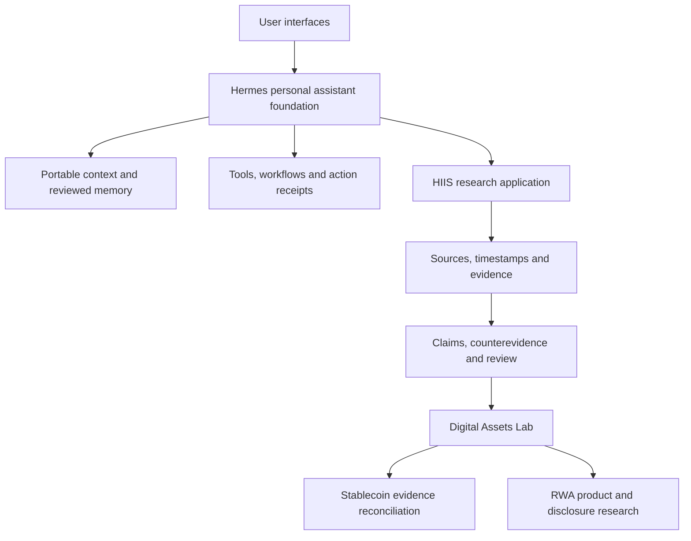

# Hermes project map

Status reviewed: 2026-09-21. This page separates the public repository from
development work described by its maintainer.

## The problem

A useful assistant should carry context from one task to the next, preserve
the reason behind a decision, and show whether a requested action actually
completed. Investment research adds another requirement: a convincing answer
must remain connected to its sources, timestamps, and counterevidence.

Hermes is the personal assistant foundation. HIIS applies those ideas to
research. Digital Assets Lab gives that research layer a focused crypto/RWA
use case.

## How the workstreams fit

The following diagram is a conceptual map of the wider project. It does not
mean every box is installed by the public scaffold.

Research evidence and personal profile memory have different purposes. A claim
in an article is not automatically a verified fact or a user preference.

## What readers can verify today

| Surface | Public evidence | Boundary |
| --- | --- | --- |
| Easy Setup | `scripts/easy_setup.py`, setup tests, [setup guide](easy-setup.md) | Generates a private markdown scaffold; does not connect services |
| System design | [Architecture](architecture.md), memory templates and maintenance notes | Documents reusable patterns; not a packaged copy of the private runtime |
| HIIS | [Research workflow](hiis.md) | Maintainer development work; plugin source and installer are not bundled here |
| Digital Assets Lab | [Scope](digital-assets-lab.md), [fictional walkthrough](../examples/digital-assets-evidence-demo.md) | Educational example; no live feed, market claim or execution capability |
| Community | [Feedback paths](../COMMUNITY.md), [roadmap](../ROADMAP.md) | Early feedback stage; no claimed adoption or usage metrics |

Development artifacts exist for HIIS and the Lab outside this public tree.
Private test records are not a substitute for a reproducible public release.
A future implementation release should include its own installation path,
fixtures, verification instructions and explicit license decision.

## Choose one entry point

For personal assistant workflows, begin with [Start Here](../START_HERE.md).
For research design, begin with the [HIIS workflow](hiis.md).
For crypto/RWA, try the [fictional evidence walkthrough](../examples/digital-assets-evidence-demo.md).

Bring one confusing step, counterexample or failed expectation to
[Community and feedback](../COMMUNITY.md). The [roadmap](../ROADMAP.md) tracks
what should improve next.
