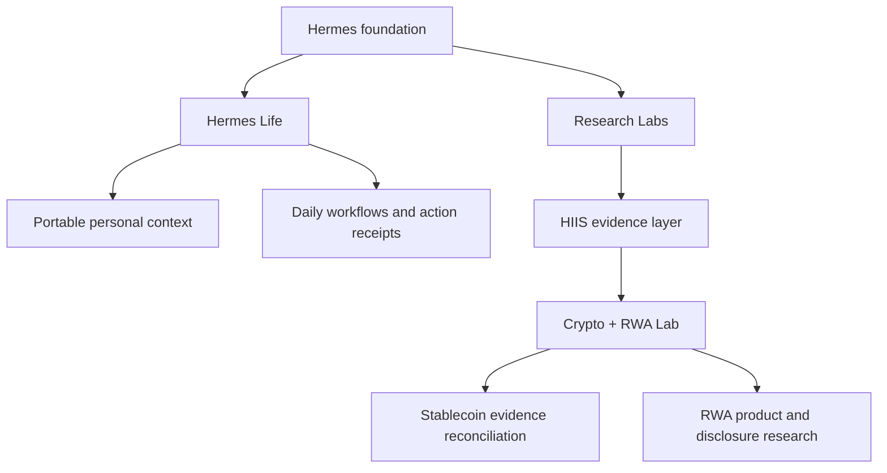

# Hermes project map

Status reviewed: 2026-09-22. This page separates the public repository from
development work described by its maintainer.

## The problem

A useful daily assistant should carry context from one task to the next,
preserve the reason behind a decision, and show whether a requested action
actually completed. That is the job of Hermes Life, the project's primary
product.

Research adds a different requirement: conclusions must remain connected to
sources, timestamps and counterevidence. That work belongs to Research Labs,
where HIIS and Crypto + RWA are still in development.

## How the workstreams fit

The following diagram is a conceptual map of the wider project. It does not
mean every box is installed by the public scaffold.

Research evidence and personal profile memory have different purposes. A claim
in an article is not automatically a verified fact or a user preference.

## What readers can verify today

| Product area | Public evidence | Boundary |
| --- | --- | --- |
| Hermes Life starter | `scripts/easy_setup.py`, setup tests, [setup guide](easy-setup.md) | Available now; creates a private Markdown scaffold and does not copy the complete private runtime |
| Hermes Life private system | [Architecture](architecture.md), memory templates and sanitized maintenance lessons | Daily-tested by the maintainer; private features are not automatically public releases |
| HIIS | [Research workflow](hiis.md) | Research Labs development; plugin source and installer are not bundled here |
| Crypto + RWA Lab | [Scope](digital-assets-lab.md), [fictional walkthrough](../examples/digital-assets-evidence-demo.md) | Development example; no live feed, market claim or execution capability |
| Community | [Feedback paths](../COMMUNITY.md), [roadmap](../ROADMAP.md) | Early feedback stage; no claimed adoption or usage metrics |

Development artifacts exist for HIIS and the Lab outside this public tree.
Private test records are not a substitute for a reproducible public release.
A future implementation release should include its own installation path,
fixtures, verification instructions and explicit license decision.

## Choose one entry point

For the primary Life product, begin with [Start Here](../START_HERE.md).
For the optional Research Labs, begin with the [HIIS workflow](hiis.md).
For crypto/RWA, try the [fictional evidence walkthrough](../examples/digital-assets-evidence-demo.md).

Bring one confusing step, counterexample or failed expectation to
[Community and feedback](../COMMUNITY.md). The [roadmap](../ROADMAP.md) tracks
what should improve next.
